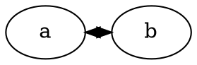

Subject: dot: short same-rank dir=both edge overlaps arrowheads between adjacent nodes

I found a stock dot layout defect where a short flat edge between adjacent
same-rank nodes draws its two arrowheads through each other, so the result reads
as a small star instead of two opposite arrows.

Minimal repro:



Observed with plain upstream Graphviz at aef8a6fd874726f17e3797561d23491bd9e156fa,
with no downstream concentration changes involved:

```text
node a box x: 0.0..54.0
node b box x: 72.0..126.0
gap between node boxes: 18.0 pt
tail arrow x extent: 55.8..65.8 = 10.0 pt
head arrow x extent: 60.2..70.2 = 10.0 pt
arrow length sum: 20.0 pt
clearance: -2.0 pt
arrowhead overlap: 5.6 pt
```

The same numbers reproduce with `-Gnewrank=true`.

The layout needs to reserve room for both arrowheads before spline clipping.
Two 10 pt arrowheads cannot fit in an 18 pt node gap, and clipping or moving
the arrowheads after layout would only hide the fact that the flat edge has no
shaft. A robust fix should increase the pair-specific same-rank separation when
a flat edge draws arrows at both physical endpoints.

For comparison, after reserving arrow length sum plus a 2 pt visible-shaft
margin in the flat-edge spacing constraint, the same repro becomes:

```text
gap between node boxes: 25.0 pt
tail arrow: 10.0 pt
head arrow: 10.0 pt
arrow length sum: 20.0 pt
clearance: 5.0 pt
```

This was not filed upstream yet.
