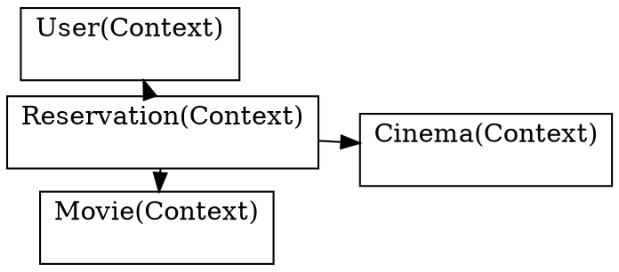
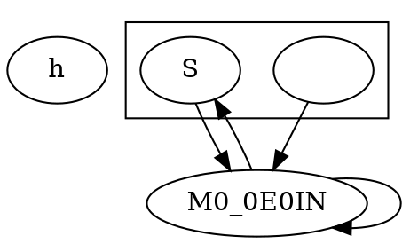
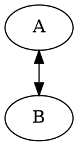

# Upstream Graphviz Defect Reports

These are ready-to-file reports only. Nothing was submitted, posted, commented, or emailed.

## 1. fdp emits nondeterministic near-zero cluster bounding boxes in xdot/json

### Minimal input



### Expected

Repeated runs of the same `fdp` layout and `-Txdot`/`-Tjson` output on the same input should emit identical bytes, or at least should not randomly flip tiny near-zero bounding-box coordinates between `0`, positive epsilon, and negative epsilon.

### Actual

On upstream `aef8a6fd874726f17e3797561d23491bd9e156fa`, rebuilt with `dot_builtins`, 20 repeated `-Txdot` runs of `tests/2282.dot` produced two output hashes: `638e91053f5b4aa6` and `250aa0b0c0465ccb`. The minimized input above also produced two hashes in back-to-back runs: `43c5771d7c66403b...` and `004b6d3fe038083d...`.

The only observed differences are cluster `bb` attributes:

```diff
-      bb="-1.5987e-14,20.853,137,62.103",
+      bb="0,20.853,137,62.103",
...
-      bb="221.28,3.9968e-15,347.28,41.25",
+      bb="221.28,-3.9968e-15,347.28,41.25",
```

The same field changes in `-Tjson`, for example `bb` changes between `0,20.853,137,62.103` and `-1.5987e-14,20.853,137,62.103`.

### Version / commit

Reproduces on upstream Graphviz commit `aef8a6fd874726f17e3797561d23491bd9e156fa` with `dot_builtins - graphviz version 15.1.1~dev.20260630.1303`.

### Analysis

This is not an xdot drawing-command difference. The changing value is the emitted graph `bb` attribute. The `fdp` path computes cluster bounding boxes in `lib/fdpgen/layout.c:setBB`, storing `GD_bb(g)` from floating-point `BB(g)` values. During xdot output, `plugin/core/gvrender_core_dot.c:dot_end_graph` calls `xdot_end_graph` and then `agwrite`, after the `bb` attribute has been attached by `lib/common/output.c:rec_attach_bb` with `%.5g` formatting from `GD_bb(g)`. Values extremely close to zero are not normalized before formatting, so run-to-run floating-point noise leaks into serialized xdot/json bytes.

Tracker check: no matching public GitLab issue found for fdp `bb` nondeterminism or the near-zero values. Search was done against `gitlab.com/graphviz/graphviz` issue/work-item pages.

## 2. concentrate aborts with `rebuild_vlists: lead is null` after rankset removal

### Minimal input



### Expected

`dot` should either reject the malformed input cleanly during parsing, or render a graph and exit 0. It should not leave dotgen rank/cluster state inconsistent enough for concentrate finalization to abort.

### Actual

On upstream `aef8a6fd874726f17e3797561d23491bd9e156fa`, the minimized input exits `rc=1` and prints:

```text
Warning: M0_0E0IN was already in a rankset, deleted from cluster %1
Error: rebuild_vlists: lead is null for rank 1
concentrate=true may not work correctly.
```

The original `tests/2766.dot` also reproduces upstream with `rc=1`, after two badly-delimited-number warnings and the same rankset deletion warnings. On the current playground branch this input exits 0; with `-Gconcentrate=false` it also exits 0.

### Version / commit

Reproduces on upstream Graphviz commit `aef8a6fd874726f17e3797561d23491bd9e156fa` with `dot_builtins - graphviz version 15.1.1~dev.20260630.1303`.

### Analysis

The error is emitted by `lib/dotgen/conc.c:rebuild_vlists`, where concentrate finalization scans each rank and returns `-1` if `GD_rankleader(g)[r]` is null. The path is `lib/dotgen/conc.c:dot_concentrate` -> `generate_finalize_candidate` -> `execute_concentration_candidate` -> `rebuild_vlists`. The minimized input causes the parser/rankset handling to remove `M0_0E0IN` from the cluster rankset, leaving rank 1 without a leader when concentrate rebuilds the cluster rank vectors.

Tracker check: related public GitLab issues already exist for this failure family. Issue #2183 includes `Error: rebuild_vlists: lead is null for rank 13` with `concentrate=true`, and work item #1436 has an older `rebuild_vlists` stack in `dot_concentrate`. I did not find this minimized rankset-removal reproducer in the public tracker.

## 3. concentrate drops one direction of a bidirectional edge pair

### Minimal input



### Expected

For a directed graph, a bidirectional pair should preserve drawable geometry for both directed edges, or the concentrated representative should visibly preserve both directions. With `-Gconcentrate=false`, both edges are drawn separately.

### Actual

On upstream `aef8a6fd874726f17e3797561d23491bd9e156fa`, the minimal input exits 0 but `-Tjson` shows one edge has no drawable geometry:

```text
concentrate=true:
A->B  pos="s,27,71.697 e,27,36.104 27,60.24 27,56.012 27,51.659 27,47.438"  _draw_=2  _hdraw_=4  _tdraw_=4
B->A  pos=null                                                        _draw_=0  _hdraw_=0  _tdraw_=0

-Gconcentrate=false:
A->B  pos="e,21.138,35.789 21.122,72.055 20.328,64.574 20.076,55.579 20.367,47.137"
B->A  pos="e,32.878,72.055 32.862,35.789 33.663,43.248 33.922,52.237 33.639,60.686"
```

The original `tests/1453.dot` shows the same defect three times. With upstream `concentrate=true`, these edges have `pos=null` and zero draw operations: `CMD_INNER_WRITE -> CMD_INNER`, `CMD_POST_DECODE_LITERALS -> CMD_BEGIN`, and `CMD_POST_WRITE_2 -> CMD_POST_WRAP_COPY`. With `-Gconcentrate=false`, all three have normal `pos` splines.

### Version / commit

Reproduces on upstream Graphviz commit `aef8a6fd874726f17e3797561d23491bd9e156fa` with `dot_builtins - graphviz version 15.1.1~dev.20260630.1303`. It also reproduces on the current playground branch; with `-Gconcentrate=false` on the current branch, both directions are drawn.

### Analysis

This is owned by the dot concentrate path, not the renderer. In `lib/dotgen/conc.c:dot_concentrate`, `concentrate_flat_edges` walks flat duplicate edges from `ND_other`. For a suppress-flat candidate, `execute_concentration_candidate` calls `fold_concentrated_edge_arrow_decorations`, removes the absorbed edge from `ND_other` with `zapinlist`, and marks it `IGNORED`. For opposite-direction edges, the representative gets start/end arrow decoration, but the absorbed edge loses its own spline and draw streams entirely. The emitted JSON proves the broken geometry directly: one directed edge remains as a graph edge object but has `pos=null` and no draw operations.

Tracker check: GitLab issue #150 is related to bidirectional edges under `concentrate=true`, but it describes concentration failing in same-rank subgroups rather than one directed edge being retained as an undrawn `pos=null` object. I did not find an exact public tracker match for this minimized two-node repro.
